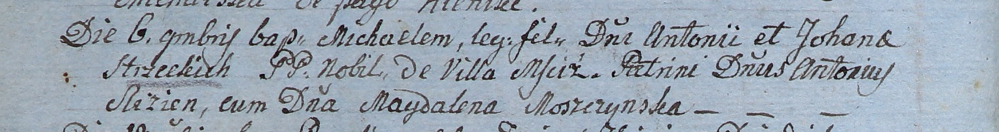

**Стжецкий Михал Антонов (Strzecki Michael)**

6 ноября 1805 г -- крещение (НИАБ 937-4-32, лист 12об, №40/1805-р).

**НИАБ 937-4-32:** Лист 12об. **Метрическая запись №40/1805-р.**

Дедиловичский костел Наисвятейшего Сердца Иисуса. 6 ноября 1805 года.
Метрическая запись о крещении.

Strzecki Michael -- сын шляхтичей с деревни Мстиж.

Strzecki Antoni -- отец.

Strzecka Johana -- мать.

Slizien Antoniusz -- крестный отец, шляхтич.

Moszczynska Magdalena -- крестная мать, шляхтянка.

Linhart Hiacinthus -- ксёндз.
