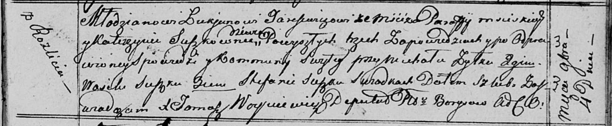

**Тарасевич Лукьян (Tarasewicz Łukjan)**

4 ноября 1816 г -- венчание с девкой Катерыной Сушко с деревни Разлитье
(НИАБ 136-13-920, лист 23, №6/1816-б (ориг)).

**НИАБ 136-13-920:** Лист 23. **Метрическая запись №6/1816-б (ориг).**

{width="6.496527777777778in"
height="1.3416819772528434in"}

Осовская Покровская церковь. 4 ноября 1816 года. Запись о венчании.

Tarasewicz Łukjan -- жених, молодой, парафии Мстижской, с деревни Мстиж.

Suszkowna Katerzyna -- невеста, девка, с деревни Разлитье.

Żyłko Michał -- свидетель.

Suszko Wasil -- свидетель.

Suszko Stefan -- свидетель.

Woyniewicz Tomasz -- ксёндз.
