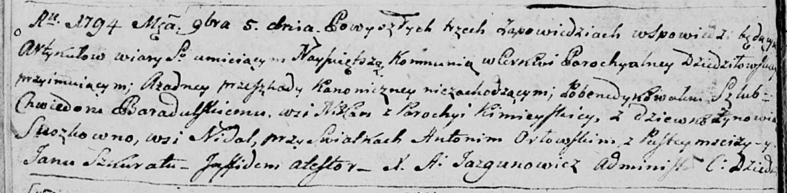
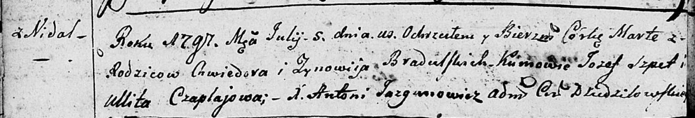
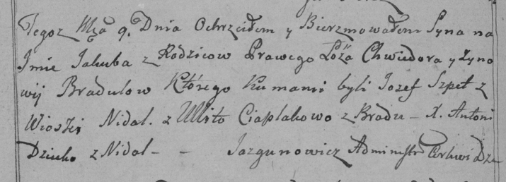
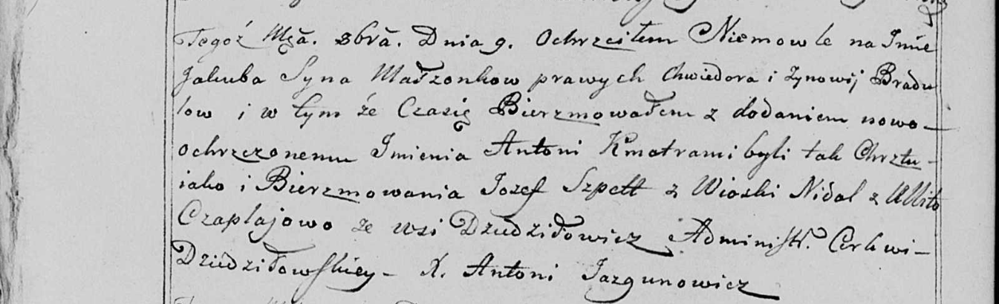

**Брадульская (Сушко) Зыновия (Bradulska Zynowija z Suszkow)**

5 ноября 1794 г -- венчание с Хведором Барадульским с деревни Иканы
Кимейской парафии (НИАБ 136-13-920, лист 1об, №10/1794-б (ориг)).

5 июля 1797 г -- крещение дочери Марты (НИАБ 136-13-894, лист 33об,
№42/1797-р (ориг)).

9 октября 1799 г -- крещение сына Якуба (НИАБ 136-13-894, лист 39об,
№40/1799-р (ориг), РГИА 823-2-18, лист 272об, №39/1799-р (коп), НИАБ
136-13-938, лист 244об, №38/1799-р (коп)).

**НИАБ 136-13-920:** Лист 1об. **Метрическая запись №10/1794-б (ориг).**

Дедиловичская Покровская церковь. 5 ноября 1794 года. Метрическая запись
о венчании.

Baradulski Chwiedor -- жених, деревня \[Иканы\], парафия Кимейская.

Suszkowna Zynowia -- невеста, девка, деревня Нидаль.

Orłowski Antoni -- свидетель, деревня Пустомстиж.

Szkurat Jan -- свидетель.

Jazgunowicz Antoni -- ксёндз.

**НИАБ 136-13-894:** Лист 33об. **Метрическая запись №42/1797-р
(ориг).**

Дедиловичская Покровская церковь. 5 июля 1797 года. Метрическая запись о
крещении.

Bradulska Marta -- дочь родителей с деревни Недаль.

Bradulski Chwiedor -- отец.

Bradulska Zynowija -- мать.

Szpet Jozef - кум.

Czaplajowa Ullita - кума.

Jazgunowicz Antoni -- ксёндз.

**НИАБ 136-13-894:** Лист 39об. **Метрическая запись №40/1799-р
(ориг).**

Дедиловичская Покровская церковь. 9 октября 1799 года. Метрическая
запись о крещении.

Bradul Jakub -- сын родителей с деревни Недаль.

Bradul Chwiedor -- отец.

Bradulowa Zynowija -- мать.

Szpet Jozef -- кум, с деревни Недаль.

Ciaplakowa Ullita -- кума, с деревни Броды.

Jazgunowicz Antoni -- ксёндз.

**РГИА 823-2-18:** Лист 272об. **Метрическая запись №39/1799-р (коп).**

Дедиловичская Покровская церковь. 9 октября 1799 года. Метрическая
запись о крещении.

Bradula Jakub -- сын родителей с деревни Недаль.

Bradula Chwiedor -- отец.

Bradulowa Zynowija -- мать.

Szpet Jozef -- кум, с деревни Недаль.

Ciaplakowa Ullita -- кума, с деревни Броды.

Jazgunowicz Antoni -- ксёндз.

**НИАБ 136-13-938:** Лист 244об. **Метрическая запись №38/1799-р
(коп).**

(См. тж. НИАБ 136-13-894, лист 39об, №40/1799-р (ориг); РГИА 823-2-18,
лист 272об, №39/1799-р (коп))

Дедиловичская Покровская церковь. 9 октября 1799 года. Метрическая
запись о крещении.

Bradula Jakub Antoni -- сын родителей с деревни Недаль.

Bradula Chwiedor -- отец.

Bradulowa Zynowija -- мать.

Szpet Jozef -- кум, с деревни Недаль.

Czaplajowa Ullita - кума, с деревни Дедиловичи \[Броды\].

Jazgunowicz Antoni -- ксёндз.
