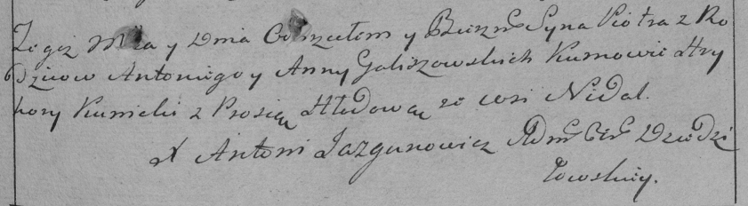

**Голишовский Антон (Goliszowski Antoni)**

20 января 1790 г -- крещение сына Петра (НИАБ 136-13-894, лист 8об,
№9/1790-р (ориг)), (РГИА 823-2-18, лист 239, №5/1790-р (коп)).

**НИАБ 136-13-894:** Лист 8об. **Метрическая запись №9/1790-р (ориг).**

{width="6.496527777777778in"
height="0.9547998687664042in"}

Дедиловичская Покровская церковь. 20 января 1790 года. Метрическая
запись о крещении.

Goliszowski Piotr -- сын родителей с деревни Недаль.

Goliszowski Antoni -- отец.

Goliszowska Anna -- мать.

Kunicki Hryhory - кум.

Hłodowa Prosia - кума.

Jazgunowicz Antoni -- ксёндз.

**РГИА 823-2-18:** Лист 239. **Метрическая запись №5/1790-р (коп).**

{width="6.496527777777778in"
height="1.792361111111111in"}

Дедиловичская Покровская церковь. 20 января 1790 года. Метрическая
запись о крещении.

Galiszowski Piotr -- сын родителей с деревни Недаль.

Galiszowski Antoni -- отец.

Galiszowska Anna -- мать.

Kunicki Hryhory -- кум.

Hłodowa Prosia - кума.

Jazgunowicz Antoni -- ксёндз.
