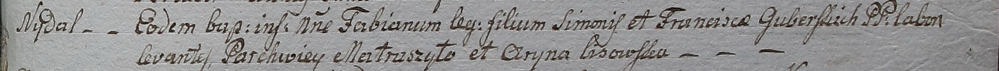

**Губерский Фабиан Сымонов (Guberski Fabian)**

20 января 1799 г -- крещение (НИАБ 1781-27-199, лист 125, №9/1799-р).

**НИАБ 1781-27-199:** Лист 125. **Метрическая запись №9/1799-р.**

Дедиловичский костел Наисвятейшего Сердца Иисуса. 20 января 1799 года.
Метрическая запись о крещении.

Guberski Fabian -- сын крестьян с деревни Недаль.

Guberski Simon -- отец.

Guberska Franciska -- мать.

Matraszyło Parchwiei -- крестный отец.

Lisowska Aryna - крестная мать.

Linhart Hyacinthus -- ксёндз.
