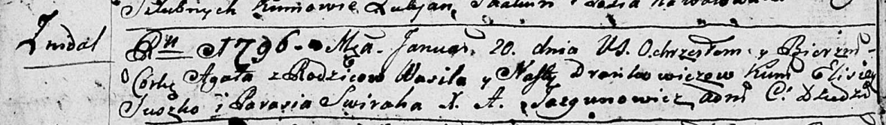

**Дранкович Наста (Drankowiczowa Nasta)**

20 января 1796 г -- крещение дочери Агаты (НИАБ 136-13-894, лист 27об,
№12/1796-р (ориг)).

**НИАБ 136-13-894:** Лист 27об. **Метрическая запись №12/1796-р
(ориг).**

Дедиловичская Покровская церковь. 20 января 1796 года. Метрическая
запись о крещении.

Drankowiczowa Agata -- дочь родителей с деревни Нeдаль.

Drankowicz Wasil -- отец.

Drankowiczowa Nasta -- мать.

Swiraha Parasia - кум.

Kowalowa Zosia - кума.

Jazgunowicz Antoni -- ксёндз.
