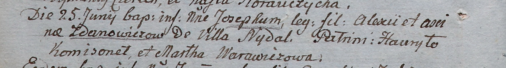

**Жданович Аксинья (Żdanowiczowa Axina)**

25 июня 1805 г -- крещение сына Иосифа (НИАБ 937-4-32, лист 11об,
№22/1805-р)

Лист 11об. **Метрическая запись №22/1805-р.**

Дедиловичский костел Наисвятейшего Сердца Иисуса. 25 июня 1805 года.
Метрическая запись о крещении.

Żdanowicz Joseph -- сын крестьян с деревни Недаль.

Żdanowicz Alexi -- отец.

Żdanowiczowa Axina -- мать.

Komisonek Hauryło -- крестный отец.

Warawiczowa Martha -- крестная мать.

Linhart Hiacinthus -- ксёндз.
