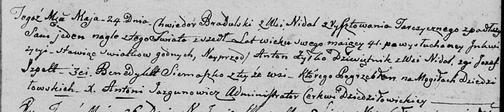

**Жилко Антон (Żyłkowicz Antoni)**

26 августа 1801 г -- венчание с вдовой Луцеей Янковой с деревни Недаль
(НИАБ 136-13-920, лист 7об, №4/1801-б (ориг)).

24 мая 1803 г -- свидетель при погребении внезапно умершего Брадульского
Хведора с деревни Недаль (НИАБ 136-13-919, лист 14, №7/1803-у (ориг)).

**НИАБ 136-13-920:** Лист 7об. **Метрическая запись №4/1801-б (ориг).**

Дедиловичская Покровская церковь. 26 августа 1801 года. Метрическая
запись о венчании.

Żylkowicz Antoni -- жених, вдовец с деревни Недаль.

Luceja Jankowa -- невеста, вдова с деревни Недаль.

Chrapowicki Wiktor, WJP -- свидетель, шляхтич.

Kosinski Waleryan -- свидетель.

Jazgunowicz Antoni -- ксёндз.

**НИАБ 136-13-919:** Лист 14. **Метрическая запись №7/1803-у (ориг).**

Дедиловичская Покровская церковь. 24 мая 1803 года. Метрическая запись
об отпевании.

Bradulski Chwiedor -- умерший, 41 год, с деревни Недаль, умер внезапно в
одиночестве, похоронен на кладбище деревни Дедиловичи, в погребении
(принимали участие) Żyłko Anton, десятник, Szpett Jozef, Siemaszko
Benedykt, все с деревни Недаль.

Jazgunowicz Antoni -- ксёндз.
