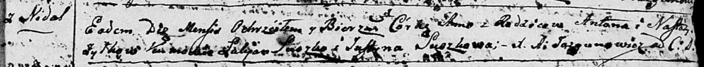
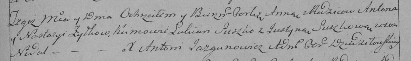

**Жилко Анна Антонова (Żyłkowna Anna)**

17 июля1793 г -- крещение (НИАБ 136-13-894, лист 20, №56/1793-р (ориг)),
(РГИА 823-2-18, лист 248, №30/1793-р (коп)).

**НИАБ 136-13-894:** Лист 20. **Метрическая запись №56/1793-р (ориг).**

Дедиловичская Покровская церковь. 17 июля 1793 года. Метрическая запись
о крещении.

Żyłkowna Anna -- дочь родителей с деревни Недаль.

Żyłko Anton -- отец.

Żyłkowa Nastazya -- мать.

Suszko Łukjan - кум.

Suszkowa Justyna - кума.

Jazgunowicz Antoni -- ксёндз.

**РГИА 823-2-18:** Лист 248. **Метрическая запись №30/1793-р (коп).**

Дедиловичская Покровская церковь. 17 июля 1793 года. Метрическая запись
о крещении.

Żyłkowna Anna -- дочь родителей с деревни Недаль.

Żyłko Anton -- отец.

Zyłkowa Nastazya -- мать.

Suszko Łukjan -- кум.

Suszkowa Justyna -- кума.

Jazgunowicz Antoni -- ксёндз.
