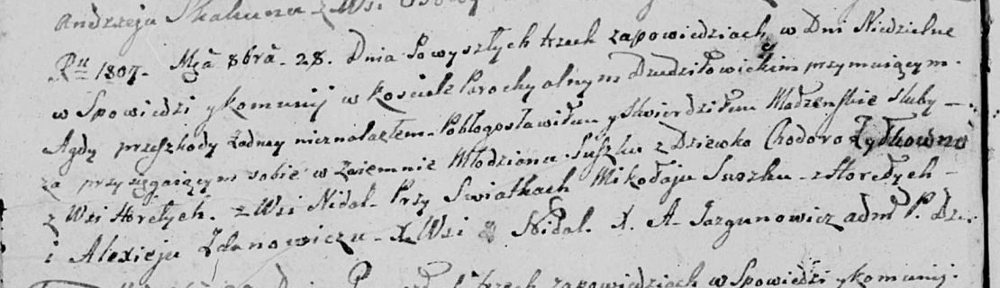

**Сушко (Жилко) Ходора (Suszkowa Chodora z Żyłkow)**

28 октября 1807 г -- венчание с молодым Сушко с деревни Горелое (НИАБ
136-13-920, лист 12об, №5/1807-б (ориг))

**НИАБ 136-13-920:** Лист 12об. **Метрическая запись №5/1807-б (ориг).**

Дедиловичская Покровская церковь. 28 октября 1807 года. Метрическая
запись о венчании.

Suszko -- жених, молодой, с деревни Горелое.

Żyłkowna Chodora -- невеста, с деревни Недаль.

Suszko Mikołay -- свидетель, с деревни Горелое.

Żdanowicz Alexiey -- свидетель, с деревни Недаль.

Jazgunowicz Antoni -- ксёндз.
