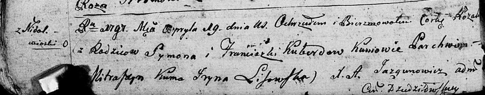

**Коберда Розалия Сымонова (Kuberdowna Rozalia)**

19 апреля 1797 г -- крещение (НИАБ 136-13-894, лист 32об, №23/1797-р
(ориг)).

**НИАБ 136-13-894:** Лист 32об. **Метрическая запись №23/1797-р
(ориг).**

{width="6.496527777777778in"
height="1.2813363954505688in"}

Дедиловичская Покровская церковь. 19 апреля 1797 года. Метрическая
запись о крещении.

Kuberdowna Rozalia -- дочь родителей с деревни Недаль.

Kuberda Symon -- отец.

Kuberdowa Franciszka -- мать.

Mitraszym Parchwien - кум.

Lisowska Jryna - кума.

Jazgunowicz Antoni -- ксёндз.
