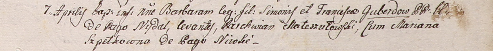

**Коберда Сымон (Kuberda, Kowerda, Guberda Symon)**

7 октября 1792 г -- свидетель при венчании Семашко Бенедыкта с Катериной
Жилко, оба с деревни Недаль (НИАБ 136-13-894, лист 71, №12/1792-б
(ориг)).

19 апреля 1797 г -- крещение дочери Розалии (НИАБ 136-13-894, лист 32об,
№23/1797-р (ориг)).

7 апреля 1801 г -- крещение дочери Барбары (НИАБ 937-4-32, лист 4,
№9/1801-р).

**НИАБ 136-13-894:** Лист 71. **Метрическая запись №12/1792-б (ориг).**

{width="6.496527777777778in"
height="1.3691721347331585in"}

Дедиловичская Покровская церковь. 7 октября 1792 года. Метрическая
запись о венчании.

Siemaszka Benedykt -- жених, с деревни Недаль.

Żyłkiewiczowa Katerzyna -- невеста, с деревни Недаль.

Kowerda Symon -- свидетель, с деревни Недаль.

Siemaszka Symon -- свидетель, с деревни Недаль.

Jazgunowicz Antoni -- ксёндз.

**НИАБ 136-13-894:** Лист 32об. **Метрическая запись №23/1797-р
(ориг).**

{width="6.496527777777778in"
height="1.2813363954505688in"}

Дедиловичская Покровская церковь. 19 апреля 1797 года. Метрическая
запись о крещении.

Kuberdowna Rozalia -- дочь родителей с деревни Недаль.

Kuberda Symon -- отец.

Kuberdowa Franciszka -- мать.

Mitraszym Parchwien - кум.

Lisowska Jryna - кума.

Jazgunowicz Antoni -- ксёндз.

**НИАБ 937-4-32:** Лист 4. **Метрическая запись №9/1801-р.**

{width="6.496527777777778in"
height="0.6854166666666667in"}

Дедиловичский костел Наисвятейшего Сердца Иисуса. 7 апреля 1801 года.
Метрическая запись о крещении.

Guberdowna Barbara -- дочь родителей с деревни Недаль.

Guberda Simoniusz -- отец.

Guberdowa Francisca -- мать.

Mateszutowski Parchwian -- крестный отец, с деревни Нивки.

Szpetkowna Mariana -- крестная мать, с деревни Нивки.

Linhart Hyacinthus -- ксёндз.
