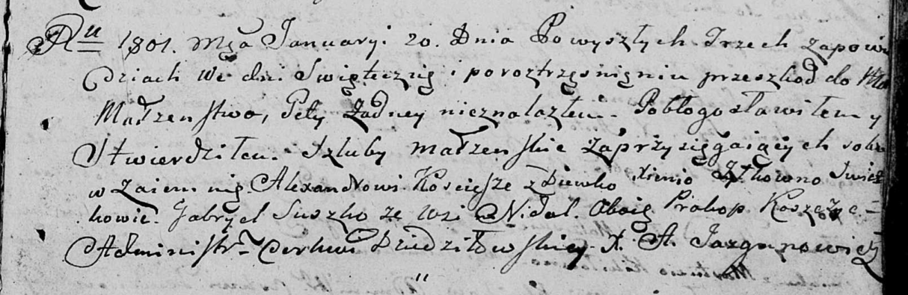

**Кошчыц (Жилко) Ксеня (Koscicszowa Xienia z Żyłkow)**

20 января 1801 г -- венчание с Александром Кошчыцем с деревни Недаль
(НИАБ 136-13-894, лист 44, №22/1801-р (ориг)).

**НИАБ 136-13-920:** Лист 7. **Метрическая запись №2/1801-б (ориг).**

{width="6.496527777777778in"
height="2.1141043307086615in"}

Дедиловичская Покровская церковь. 20 января 1801 года. Метрическая
запись о венчании.

Koscicsz Alexander -- жених, с деревни Недаль.

Żyłkowna Xienia -- невеста, девка с деревни Недаль.

Suszko Gabriel -- свидетель, с деревни Недаль.

Koszczyc Prakop -- свидетель, с деревни Недаль.

Jazgunowicz Antoni -- ксёндз.
