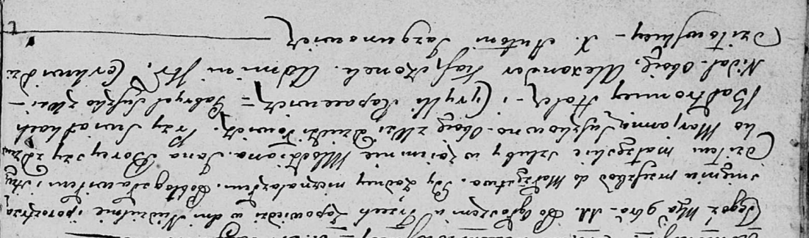

**Кошчыц Пракоп (Koscicsz Prakop)**

20 января 1801 г -- свидетель венчания Александра Кошчыца с деревни
Недаль с девкой Ксеней Жилко с деревни Недаль (НИАБ 136-13-894, лист 44,
№22/1801-р (ориг)).

11 ноября 1802 г -- свидетель венчания молодого Яна Борейши с деревни
Дедиловичи с девкой Марьяной Сушко с деревни Дедиловичи (НИАБ
136-13-920, лист 8об, №9/1802-б (ориг)).

**НИАБ 136-13-920:** Лист 7. **Метрическая запись №2/1801-б (ориг).**

{width="6.496527777777778in"
height="2.1141043307086615in"}

Дедиловичская Покровская церковь. 20 января 1801 года. Метрическая
запись о венчании.

Koscicsz Alexander -- жених, с деревни Недаль.

Żyłkowna Xienia -- невеста, девка с деревни Недаль.

Suszko Gabriel -- свидетель, с деревни Недаль.

Koszczyc Prakop -- свидетель, с деревни Недаль.

Jazgunowicz Antoni -- ксёндз.

**НИАБ 136-13-920:** Лист 8об. **Метрическая запись №9/1802-б (ориг).**

{width="6.496527777777778in"
height="1.9196576990376204in"}

Дедиловичская Покровская церковь. 11 ноября 1802 года. Метрическая
запись о венчании.

Boreysza Jan -- жених, молодой, с деревни Дедиловичи.

Suszkowa Marjanna -- невеста, девка, с деревни Дедиловичи.

Holcz Bałtromey -- свидетель.

Rapacewicz Cyryll -- свидетель.

Suszko Gabryel -- свидетель, с деревни Недаль.

Kaszczonek Alexander -- свидетель, с деревни Недаль.

Jazgunowicz Antoni -- ксёндз.
