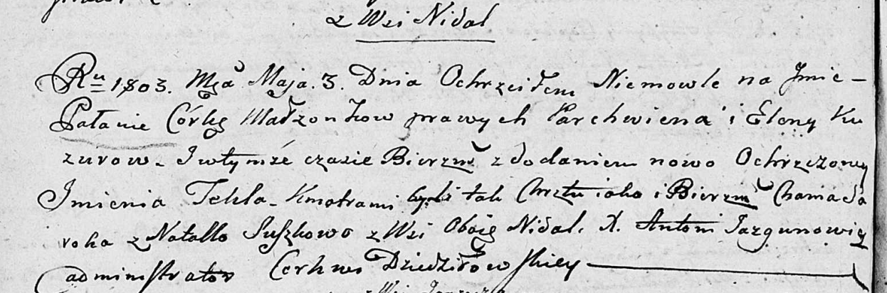
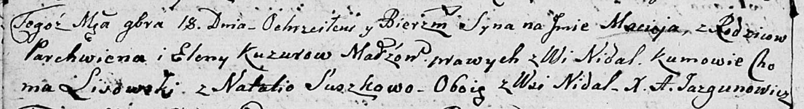
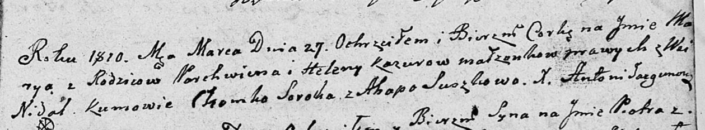

**Кузура Елена (Kuzurowa, Kazurowa Elena)**

3 мая 1803 г -- крещение дочери Палани Текли (НИАБ 136-13-894, лист
50об, №19/1803-р (ориг)).

18 ноября 1806 г -- крещение сына Мацея (НИАБ 136-13-894, лист 61об,
№50/1806-р (ориг)).

27 марта 1810 г -- крещение дочери Марыи (НИАБ 136-13-894, лист 77,
№14/1810-р (ориг)).

**НИАБ 136-13-894:** Лист 50об. **Метрическая запись №19/1803-р
(ориг).**

Дедиловичская Покровская церковь. 3 мая 1803 года. Метрическая запись о
крещении.

Kuzurowna Pałania Tekla -- дочь родителей с деревни Недаль.

Kuzura Parchwien -- отец.

Kuzurowa Elena -- мать.

Saroka Chama -- кум.

Suszkowa Natalla -- кума, с деревни Недаль.

Jazgunowicz Antoni -- ксёндз.

**НИАБ 136-13-894:** Лист 61об. **Метрическая запись №50/1806-р
(ориг).**

Дедиловичская Покровская церковь. 18 ноября 1806 года. Метрическая
запись о крещении.

Kuzura Maciey -- сын родителей с деревни Недаль.

Kuzura Parchwien -- отец.

Kuzurowa Elena -- мать.

Lisowski Choma -- кум, с деревни Недаль.

Suszkowa Natalia -- кума, с деревни Недаль.

Jazgunowicz Antoni -- ксёндз.

**НИАБ 136-13-894:** Лист 77. **Метрическая запись №14/1810-р (ориг).**

Дедиловичская Покровская церковь. 27 марта 1810 года. Метрическая запись
о крещении.

Kazurowna Marya -- дочь родителей с деревни Недаль.

Kazura Parchwien -- отец.

Kazurowa Elena -- мать.

Soroko Chomka -- кум.

Suszkowa Ahapa -- кума.

Jazgunowicz Antoni -- ксёндз.
