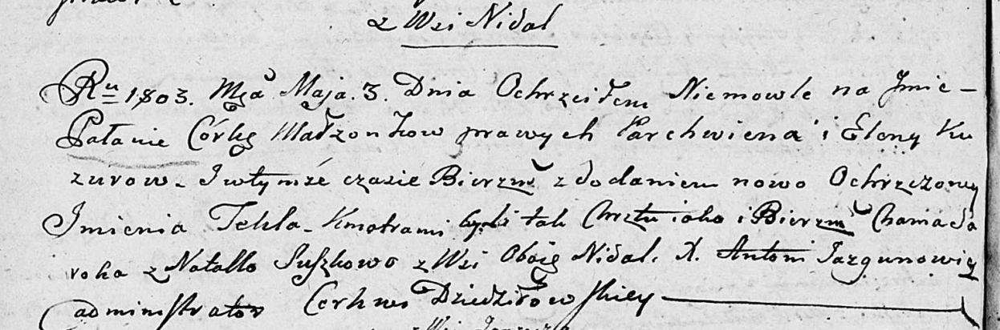

**Кузура Паланя Пархвенова (Kuzurowna Pałania Tekla)**

3 мая 1803 г -- крещение (НИАБ 136-13-894, лист 50об, №19/1803-р
(ориг)).

**НИАБ 136-13-894:** Лист 50об. **Метрическая запись №19/1803-р
(ориг).**

Дедиловичская Покровская церковь. 3 мая 1803 года. Метрическая запись о
крещении.

Kuzurowna Pałania Tekla -- дочь родителей с деревни Недаль.

Kuzura Parchwien -- отец.

Kuzurowa Elena -- мать.

Saroka Chama -- кум.

Suszkowa Natalla -- кума, с деревни Недаль.

Jazgunowicz Antoni -- ксёндз.
