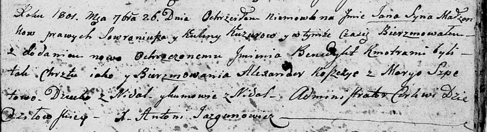
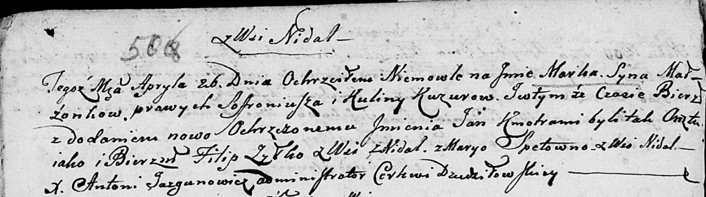
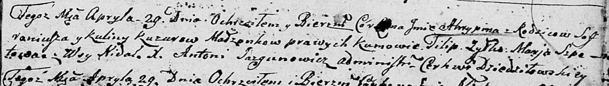
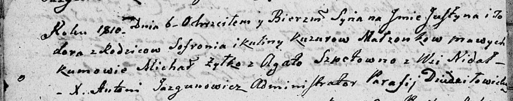

**Кузура Кулина (Kuzurowa Kulina)**

26 сентября 1801 г -- крещение сына Яна Бенедыкта (НИАБ 136-13-894, лист
44, №22/1801-р (ориг)).

26 апреля 1803 г -- крещение сына Марка Яна (НИАБ 136-13-894, лист 50об,
№17/1803-р (ориг)).

29 апреля 1806 г -- крещение дочери Агрыпины (НИАБ 136-13-894, лист 60,
№23/1806-р (ориг)).

6 июня 1810 г -- крещение сына Юстына Тодора (НИАБ 136-13-894, лист
77об, №18/1810-р (ориг)).

**НИАБ 136-13-894:** Лист 44. **Метрическая запись №22/1801-р (ориг).**

Дедиловичская Покровская церковь. 26 сентября 1801 года. Метрическая
запись о крещении.

Kuzura Jan Benedykt -- сын родителей с деревни Недаль.

Kuzura Sowroniusz -- отец.

Kuzurowa Kulina -- мать.

Koszczyc Alexander -- кум, с деревни Недаль.

Szpetowa Maryia -- кума, с деревни Недаль.

Jazgunowicz Antoni -- ксёндз.

**НИАБ 136-13-894:** Лист 50об. **Метрическая запись №17/1803-р
(ориг).**

Дедиловичская Покровская церковь. 26 апреля 1803 года. Метрическая
запись о крещении.

Kuzura Marka Jan -- сын родителей с деревни Недаль.

Kuzura Sofroniusz -- отец.

Kuzurowa Kulina -- мать.

Żylko Filip -- кум, с деревни Недаль.

Szpetowna Marya -- кума, с деревни Недаль.

**НИАБ 136-13-894:** Лист 60. **Метрическая запись №23/1806-р (ориг).**

Дедиловичская Покровская церковь. 29 апреля 1806 года. Метрическая
запись о крещении.

Kuzurowna Ahrypina -- дочь родителей с деревни Недаль.

Kuzura Sofroniusz -- отец.

Kuzurowa Kulina -- мать.

Żyłko Filip -- кум.

Szpetowa Marja -- кума.

Jazgunowicz Antoni -- ксёндз.

**НИАБ 136-13-894:** Лист 77об. **Метрическая запись №18/1810-р
(ориг).**

Дедиловичская Покровская церковь. 6 \[июня\] 1810 года. Метрическая
запись о крещении.

Kuzura Justyn Todor -- сын родителей из деревни Недаль.

Kuzura Sofroni -- отец.

Kuzurowa Kulina -- мать.

Żyłko Michaś -- кум.

Szpetowna Agata -- кума.

Jazgunowicz Antoni -- ксёндз.
