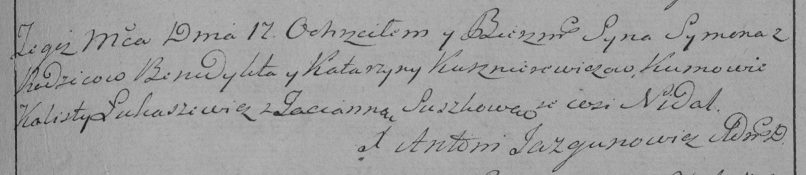

**Кушнеревич Бенедыхт (Kuszniarewicz Benedycht)**

17 февраля 1796 г -- крещение сына Сымона (НИАБ 136-13-894, лист 28,
№20/1796-р (ориг)), (РГИА 823-2-18, лист 255, №7/1796-р (коп)).

**НИАБ 136-13-894:** Лист 28. **Метрическая запись №20/1796-р (ориг).**

{width="6.496527777777778in"
height="0.9957010061242345in"}

Дедиловичская Покровская церковь. 17 февраля 1796 года. Метрическая
запись о крещении.

Kuszniarewicz Symon -- сын родителей с деревни Нeдаль.

Kuszniarewicz Benedycht -- отец.

Kuszniarewiczowa Katerzyna -- мать.

Łukaszewicz Kalist - кум.

Suszkowa Taciana - кума.

Jazgunowicz Antoni -- ксёндз.

**РГИА 823-2-18:** Лист 255. **Метрическая запись №7/1796-р (коп).**

{width="6.496527777777778in"
height="1.4104166666666667in"}

Дедиловичская Покровская церковь. 17 февраля 1796 года. Метрическая
запись о крещении.

Kusznierewicz Symon -- сын родителей с деревни Недаль.

Kusznierewicz Benedykt -- отец.

Kusznierewiczowa Katarzyna -- мать.

Łukaszewicz Lalisty -- кум.

Suszkowa Tacianna -- кума.

Jazgunowicz Antoni -- ксёндз.
