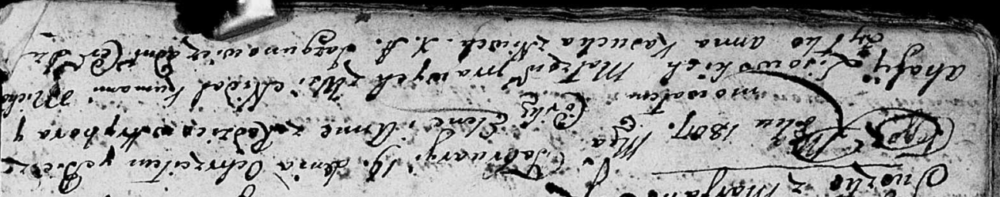

**Лисовский Агафия (Lisowska Ahafija)**

19 февреля 1807 г -- крещение дочери Елены Анны (НИАБ 136-13-894, лист
61об, №6/1807-р (ориг)).

**НИАБ 136-13-894:** Лист 61об. **Метрическая запись №6/1807-р (ориг).**

{width="6.496527777777778in"
height="1.2820067804024498in"}

Дедиловичская Покровская церковь. 19 февраля 1807 года. Метрическая
запись о крещении.

Lisowska Elena Anna -- дочь родителей с деревни Недаль.

Lisowski Hryhor -- отец.

Lisowska Ahafija -- мать.

Żyłko Michał -- кум.

Kasucka Anna -- кума, с деревни Нивки.

Jazgunowicz Antoni -- ксёндз.
