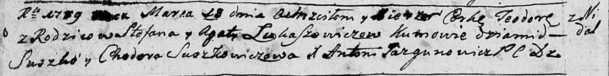
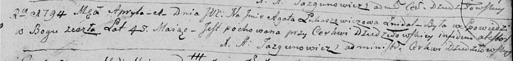

**Лукашевич Агата (Łukaszowiczowa Agata)**

19 марта 1789 г -- крещение дочери Тодоры (НИАБ 136-13-894, лист 6об,
№18/1789-р (ориг)).

1 апреля 1794 г -- отпевание, умерла в возрасте 45 лет (родилась около
1749 г) (НИАБ 136-13-919, лист 2, №22/1794-у (ориг)).

**НИАБ 136-13-894:** Лист 6об. **Метрическая запись №18/1789-р (ориг).**

Дедиловичская Покровская церковь. 19 марта 1789 года. Метрическая запись
о крещении.

Łukaszowiczowna Teodora -- дочь родителей с деревни Недаль.

Łukaszowicz Stefan -- отец.

Łukaszowiczowa Agata -- мать.

Suszko Dziamid - кум.

Suszkowiczowa Chodora - кума.

Jazgunowicz Antoni -- ксёндз.

**НИАБ 136-13-919:** Лист 2. **Метрическая запись №22/1794-у (ориг).**

Дедиловичская Покровская церковь. 1 апреля 1794 года. Метрическая запись
об отпевании.

Łukaszewiczowa Agata -- умершая, 45 лет, с деревни Недаль, похоронена
при церкви Дедиловичской.

Jazgunowicz Antoni -- ксёндз.
