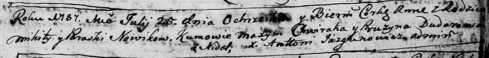
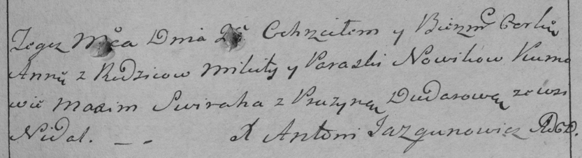

**Новик Микита (Nowik Mikita)**

25 июля 1787 г -- крещение дочери Анна (НИАБ 136-13-894, лист 2,
№33/1787-р (ориг)), (НИАБ 136-13-894, лист 2, №33/1787-р (ориг)).

**НИАБ 136-13-894:** Лист 2. **Метрическая запись №33/1787-р (ориг).**

Дедиловичская Покровская церковь. 25 июля 1787 года. Метрическая запись
о крещении.

Nowikowna Anna -- дочь родителей с деревни Недаль.

Nowik Mikita -- отец.

Nowikowa Paraska -- мать.

Chwiraha Maxym -- кум.

Dudaronkowa Pruzyna - кума.

Jazgunowicz Antoniusz -- ксёндз.

**РГИА 823-2-18:** Лист 234. **Метрическая запись №20/1787-р (коп).**

Дедиловичская Покровская церковь. 25 июля 1787 года. Метрическая запись
о крещении.

Nowikowna Anna -- дочь родителей с деревни Недаль.

Nowik Mikita -- отец.

Nowikowa Paraska -- мать.

Swiraha Maxim -- кум.

Dudarowa Pruzyna - кума.

Jazgunowicz Antoni -- ксёндз.
