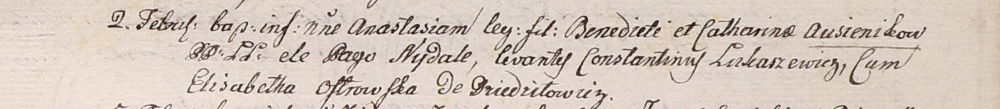

**Овсяник Анастасия Бенедиктова (Ausienikowna Anastasia)**

2 февраля 1801 г -- крещение (НИАБ 937-4-32, лист 4, №5/1800-р).

**НИАБ 937-4-32:** Лист 4. **Метрическая запись №5/1801-р.**

Дедиловичский костел Наисвятейшего Сердца Иисуса. 2 февраля 1801 года.
Метрическая запись о крещении.

Ausienikowna Anastasia -- дочь крестьян с деревни Недаль.

Ausienik Benedict -- отец.

Ausienikowa Catharina -- мать.

Łukaszewicz Constantin -- крестный отец.

Ostrowska Elisabetha -- крестная мать, с деревни Дедиловичи.

Linhart Hyacinthus -- ксёндз.
