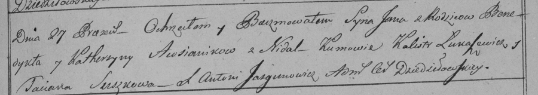

**Овсяник Катерына (Owsianikowa, Ausienikowa Katerzyna)**

27 мая 1798 г -- крещение сына Яна (НИАБ 136-13-894, лист 36, №21/1798-р
(ориг)), (РГИА 823-2-18, лист 264, №21/1798-р (коп)).

2 февраля 1801 г -- крещение дочери Анастасии (НИАБ 937-4-32, лист 4,
№5/1800-р).

**НИАБ 136-13-894:** Лист 36. **Метрическая запись №21/1798-р (ориг).**

Дедиловичская Покровская церковь. 27 мая 1798 года. Метрическая запись о
крещении.

Owsianik Jan -- сын родителей с деревни Недаль.

Owsianik Benedykt -- отец.

Owsianikowa Katerzyna -- мать.

Łukaszowicz Kalist - кум.

Suszkowa Taciana - кума.

Jazgunowicz Antoni -- ксёндз.

**РГИА 823-2-18:** Лист 264. **Метрическая запись №21/1798-р (коп).**

Дедиловичская Покровская церковь. 27 мая 1798 года. Метрическая запись о
крещении.

Awsianik Jan -- сын родителей с деревни Недаль.

Awsianik Benedykt -- отец.

Awsianikowa Katerzyna -- мать.

Łukaszewicz Kalistr -- кум.

Suszkowa Taciana -- кума.

Jazgunowicz Antoni -- ксёндз.

**НИАБ 937-4-32:** Лист 4. **Метрическая запись №5/1801-р.**

Дедиловичский костел Наисвятейшего Сердца Иисуса. 2 февраля 1801 года.
Метрическая запись о крещении.

Ausienikowna Anastasia -- дочь крестьян с деревни Недаль.

Ausienik Benedict -- отец.

Ausienikowa Catharina -- мать.

Łukaszewicz Constantin -- крестный отец.

Ostrowska Elisabetha -- крестная мать, с деревни Дедиловичи.

Linhart Hyacinthus -- ксёндз.
