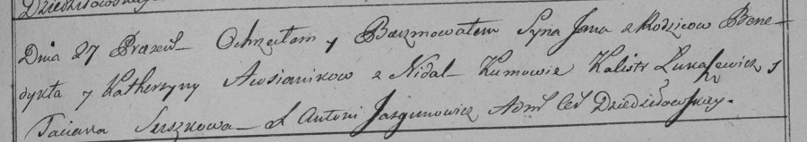

**Овсяник Ян Бенедыктов (Owsianik Jan)**

27 мая 1798 г -- крещение (НИАБ 136-13-894, лист 36, №21/1798-р (ориг)),
(РГИА 823-2-18, лист 264, №21/1798-р (коп)).

**НИАБ 136-13-894:** Лист 36. **Метрическая запись №21/1798-р (ориг).**

{width="6.496527777777778in"
height="0.9547998687664042in"}

Дедиловичская Покровская церковь. 27 мая 1798 года. Метрическая запись о
крещении.

Owsianik Jan -- сын родителей с деревни Недаль.

Owsianik Benedykt -- отец.

Owsianikowa Katerzyna -- мать.

Łukaszowicz Kalist - кум.

Suszkowa Taciana - кума.

Jazgunowicz Antoni -- ксёндз.

**РГИА 823-2-18:** Лист 264. **Метрическая запись №21/1798-р (коп).**

{width="6.496527777777778in"
height="1.1479166666666667in"}

Дедиловичская Покровская церковь. 27 мая 1798 года. Метрическая запись о
крещении.

Awsianik Jan -- сын родителей с деревни Недаль.

Awsianik Benedykt -- отец.

Awsianikowa Katerzyna -- мать.

Łukaszewicz Kalistr -- кум.

Suszkowa Taciana -- кума.

Jazgunowicz Antoni -- ксёндз.
