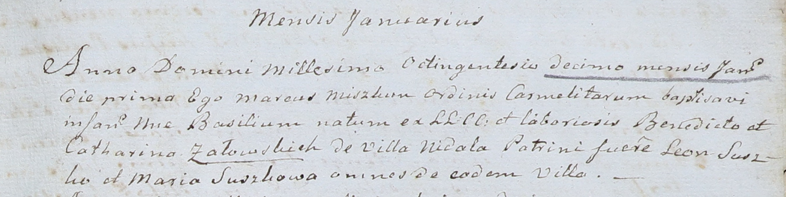

**Семашко Базыль Бенедиктов (Siemaszka, Załowski Basili)**

1 января 1810 г -- крещение (НИАБ 937-4-32, лист 21, №1/1810-р).

**НИАБ 937-4-32:** Лист 21. **Метрическая запись №1/1810-р.**

Дедиловичский костел Наисвятейшего Сердца Иисуса. 1 января 1810 года.
Метрическая запись о крещении.

Załowski \[Siemaszko\] Basili -- сын крестьян с деревни Недаль.

Załowski \[Siemaszko\] Benedict -- отец.

Załowska \[Siemaszkowa\] Catharina -- мать.

Suszko Leon -- крестный отец, с деревни Недаль.

Suszkowa Maria -- крестная мать, с деревни Недаль.

Miszkun Marcus -- ксёндз, комендант Дедиловичский.
