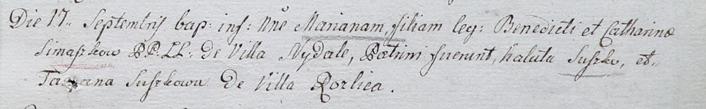

**Семашко Марьяна Бенедиктова (Siemaszkowna Mariana)**

17 сентября 1802 г -- крещение (НИАБ 937-4-32, лист 7, №28/1802-р).

**НИАБ 937-4-32:** Лист 7. **Метрическая запись №28/1802-р.**

Дедиловичский костел Наисвятейшего Сердца Иисуса. 17 сентября 1802 года.
Метрическая запись о крещении.

Simaszkowna Mariana -- дочь родителей с деревни Недаль.

Simaszko Benedict -- отец.

Simaszkowa Catharina -- мать.

Suszko Kaluta -- крестный отец.

Suszkowa Tacyana -- крестная мать, с деревни Разлитье.

Linhart Hyacinthus -- ксёндз.
