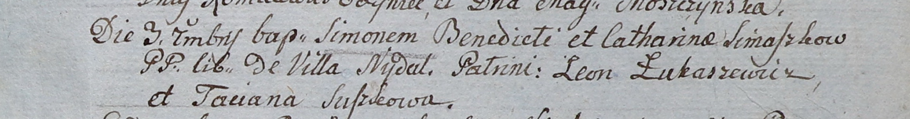

**Семашко Симон Бенедыктов (Simaszko Simon)**

3 сентября 1805 г -- крещение (НИАБ 937-4-32, лист 12, №31/1805-р).

**НИАБ 937-4-32:** Лист 12. **Метрическая запись №31/1805-р.**

Дедиловичский костел Наисвятейшего Сердца Иисуса. 3 сентября 1805 года.
Метрическая запись о крещении.

Simaszko Simon -- сын вольных людей с деревни Недаль.

Simaszko Benedict -- отец.

Simaszkowa Catharina -- мать.

Łukaszewicz Leon -- крестный отец.

Suszkowa Taciana -- крестная мать.

Linhart Hiacinthus -- ксёндз.
