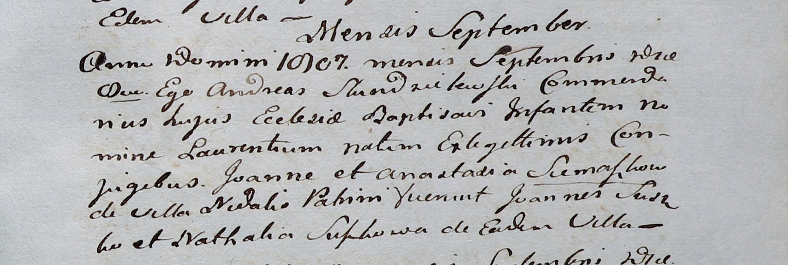

**Семашко Лаврентий Иоаннов (Siemaszko Łaurenti)**

Сентябрь 1807 г -- крещение (НИАБ 937-4-32, лист 16, №16/1807-р).

**НИАБ 937-4-32:** Лист 16. **Метрическая запись №16/1807-р.**

Дедиловичский костел Наисвятейшего Сердца Иисуса. сентября 1807 года.
Метрическая запись о крещении.

Siemaszko Łaurenti -- сын родителей с деревни Недаль.

Siemaszko Joann -- отец.

Siemaszkowa Anastazia -- мать.

Suszko Joann -- крестный отец.

Suszkowa Nathalia -- крестная мать, с деревни Недаль.

Scindzelewski Andreas -- ксёндз, викарий Дедиловичский.
