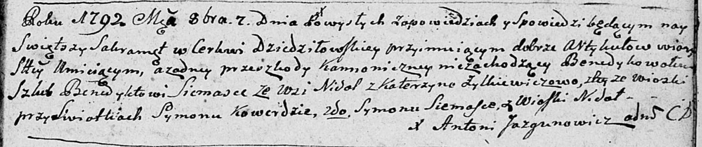

**Семашко Сымон (Siemaszka Symon)**

7 октября 1792 г -- свидетель при венчании Семашко Бенедыкта с Катериной
Жилко, оба с деревни Недаль (НИАБ 136-13-894, лист 71, №12/1792-б
(ориг)).

**НИАБ 136-13-894:** Лист 71. **Метрическая запись №12/1792-б (ориг).**

Дедиловичская Покровская церковь. 7 октября 1792 года. Метрическая
запись о венчании.

Siemaszka Benedykt -- жених, с деревни Недаль.

Żyłkiewiczowa Katerzyna -- невеста, с деревни Недаль.

Kowerda Symon -- свидетель, с деревни Недаль.

Siemaszka Symon -- свидетель, с деревни Недаль.

Jazgunowicz Antoni -- ксёндз.
