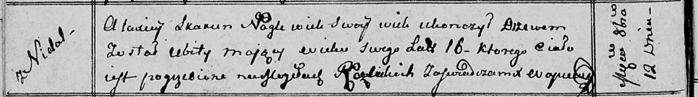

**Скакун Аляксей (Skakun Alaxiey)**

12 октября 1812 г -- отпевание, убит деревом в возрасте 16 лет (родился
около 1796 г) (НИАБ 136-13-919, лист 24об, №21/1812-у (ориг)).

**НИАБ 136-13-919:** Лист 24об. **Метрическая запись №21/1812-у
(ориг).**

Осовская униатская церковь. 12 октября 1812 года. Метрическая запись об
отпевании.

Skakun Alaxiey -- убит деревом, 16 лет, с деревни Недаль, похоронен на
кладбище деревни Разлитье.

Woyniewicz Tomasz -- ксёндз.
