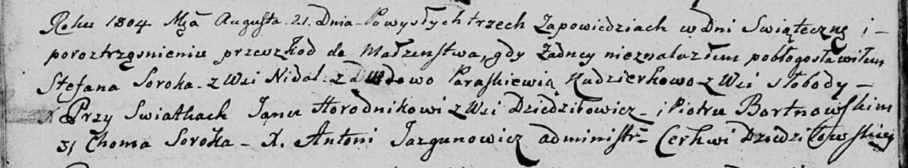

**Сорока Стефан (Soroka Stefan)**

21 августа 1804 г -- венчание с вдовой Параскевией Кудзерко с деревни
Слобода (НИАБ 136-13-920, лист 10об, №6/1804-б (ориг)).

**НИАБ 136-13-920:** Лист 10об. **Метрическая запись №6/1804-б (ориг).**

Дедиловичская Покровская церковь. 21 августа 1804 года. Метрическая
запись о венчании.

Soroka Stefan -- жених, с деревни Недаль.

Kudzierkowa Paraskiewia -- невеста, вдова, с деревни Слобода.

Horodnikow Jan -- свидетель, с деревни Дедиловичи.

Bortnowski Piotr -- свидетель.

Soroka Choma -- свидетель.

Jazgunowicz Antoni -- ксёндз.
