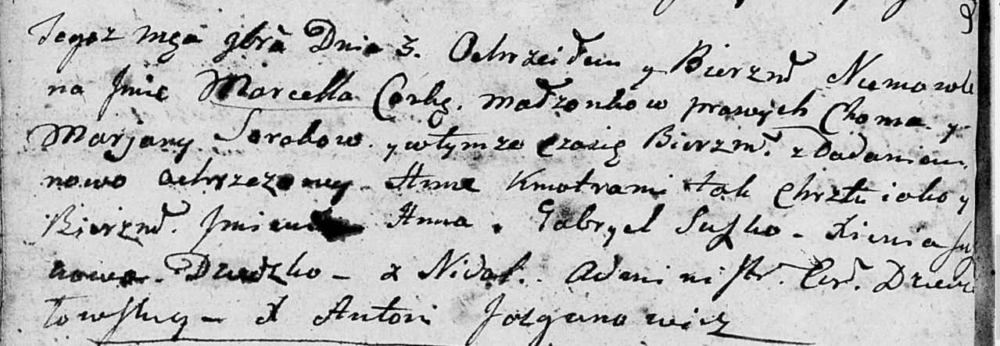

**Сорока Марцелла Хомова (Sorokowna Marcella Anna)**

3 ноября 1801 г -- крещение (НИАБ 136-13-894, лист 44об, №27/1801-р
(ориг)).

**НИАБ 136-13-894:** Лист 44об. **Метрическая запись №27/1801-р
(ориг).**

Дедиловичская Покровская церковь. 3 ноября 1801 года. Метрическая запись
о крещении.

Sorokowna Marcella Anna -- сын родителей с деревни Недаль.

Soroka Choma -- отец.

Sorokowa Marjana -- мать.

Suszko Gabriel -- кум.

Suszkowa Xienia -- кума.

Jazgunowicz Antoni -- ксёндз.
