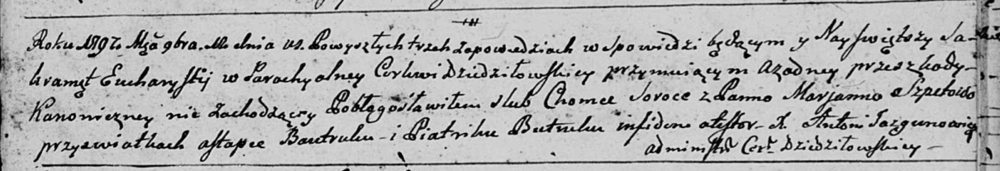
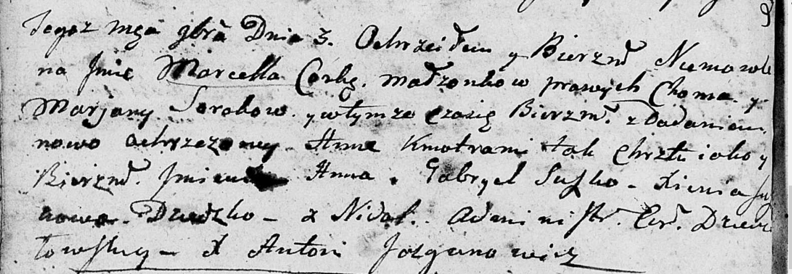

**Сорока Хома (Soroka Choma)**

12 ноября 1797 г -- венчание с Марьяной Шпет (НИАБ 136-13-920, лист 5,
№14/1797-б (ориг)).

3 ноября 1801 г -- крещение дочери Марцеллы Анны (НИАБ 136-13-894, лист
44об, №27/1801-р (ориг)).

**НИАБ 136-13-920:** Лист 5. **Метрическая запись №14/1797-б (ориг).**

Дедиловичская Покровская церковь. 12 ноября 1797 года. Метрическая
запись о венчании.

Soroka Choma -- жених с деревни \[Недаль\].

Szpetowa Marjanna -- невеста.

Bautruk Astapka -- свидетель.

Batruk Piatrik -- свидетель.

Jazgunowicz Antoni -- ксёндз.

**НИАБ 136-13-894:** Лист 44об. **Метрическая запись №27/1801-р
(ориг).**

Дедиловичская Покровская церковь. 3 ноября 1801 года. Метрическая запись
о крещении.

Sorokowna Marcella Anna -- сын родителей с деревни Недаль.

Soroka Choma -- отец.

Sorokowa Marjana -- мать.

Suszko Gabriel -- кум.

Suszkowa Xienia -- кума.

Jazgunowicz Antoni -- ксёндз.
