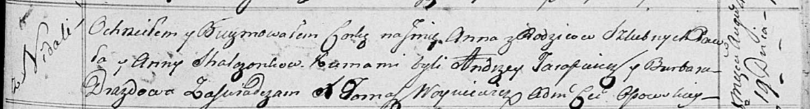

**Стрельчёнок Анна Павлова (Stralczonkowna Anna)**

19 августа 1817 г -- крещение (НИАБ 136-13-894, лист 97, №51/1817-р
(ориг)).

**НИАБ 136-13-894:** Лист 97. **Метрическая запись №51/1817-р (ориг).**

Осовская Покровская церковь. 19 августа 1817 года. Метрическая запись о
крещении.

Stralczonkowna Anna -- дочь родителей с деревни Недаль.

Stralczonek Paweł -- отец.

Stralczonkowa Anna -- мать.

Tarasewicz Andrzey -- кум.

Drazdowa Barbara -- кума.

Woyniewicz Tomasz -- ксёндз.
