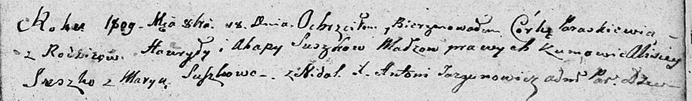

**Сушко Агапа (Suszkowa Ahapa)**

18 октября 1809 г -- крещение дочери Параскевии (НИАБ 136-13-894, лист
76, №55/1809-р (ориг)).

**НИАБ 136-13-894:** Лист 76. **Метрическая запись №55/1809-р (ориг).**

Дедиловичская Покровская церковь. 18 октября 1809 года. Метрическая
запись о крещении.

Suszkowna Paraskiewia -- дочь родителей из деревни Недаль.

Suszko Hauryła -- отец.

Suszkowa Ahapa -- мать.

Suszko Alisiey -- кум.

Suszkowa Marya -- кума.

Jazgunowicz Antoni -- ксёндз.
