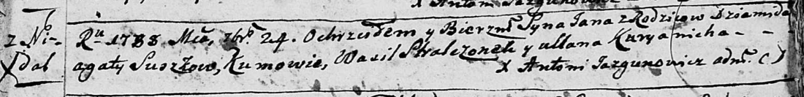
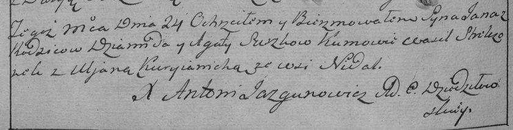

**Сушко Ян Демидов (Suszko Jan)**

24 сентября 1788 г -- крещение (НИАБ 136-13-894, лист 5, №48/1788-р
(ориг)), (РГИА 823-2-18, лист 236об, №26/1788-р (коп)).

**НИАБ 136-13-894:** Лист 5. **Метрическая запись №48/1788-р (ориг).**

Дедиловичская Покровская церковь. 24 сентября 1788 года. Метрическая
запись о крещении.

Suszko Jan -- сын родителей с деревни Недаль.

Suszko Dziamid -- отец.

Suszkowa Agata -- мать.

Stralczonek Wasil - кум.

Kuryanicha Ullana - кума.

Jazgunowicz Antoni -- ксёндз.

**РГИА 823-2-18:** Лист 236об. **Метрическая запись №26/1788-р (коп).**

Дедиловичская Покровская церковь. 24 сентября 1788 года. Метрическая
запись о крещении.

Suszko Jan -- сын родителей с деревни Недаль.

Suszko Dziamid -- отец.

Suszkowa Agata -- мать.

Stralczonek Wasil -- кум.

Kuryianicha Uljana - кума.

Jazgunowicz Antoni -- ксёндз.
