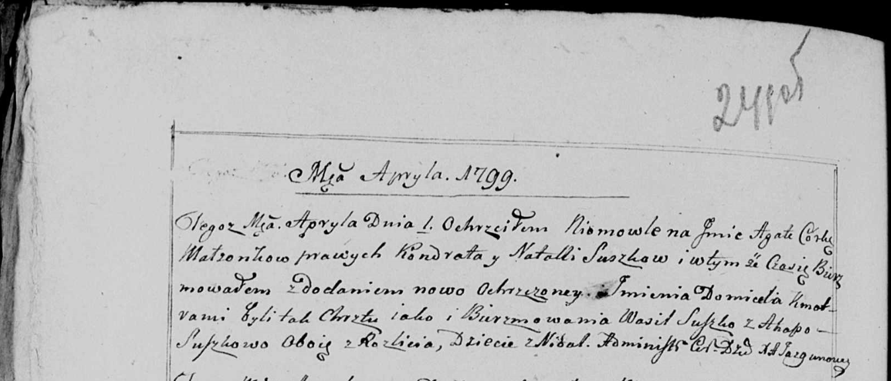

**Сушко Агата Кондратова (Suszkowna Agata Ewa)**

1 апреля 1799 г -- крещение (НИАБ 136-13-894, лист 38об, №16/1799-р
(ориг)), (РГИА 823-2-18, лист 268об, №16/1799-р (коп), НИАБ 136-13-938,
лист 241об, №16/1799-р (коп)).

**НИАБ 136-13-894:** Лист 38об. **Метрическая запись №16/1799-р
(ориг).**

{width="6.496527777777778in"
height="0.9661986001749782in"}

Дедиловичская Покровская церковь. 1 апреля 1799 года. Метрическая запись
о крещении.

Suszkowna Agata Ewa -- дочь родителей с деревни Недаль.

Suszko Kondrat -- отец.

Suszkowa Natalla -- мать.

Suszko Wasil-- кум.

Suszkowa Ahapa -- кума.

Jazgunowicz Antoni -- ксёндз.

**РГИА 823-2-18:** Лист 268об. **Метрическая запись №16/1799-р (коп).**

{width="6.496527777777778in"
height="1.8263888888888888in"}

Дедиловичская Покровская церковь. 1 апреля 1799 года. Метрическая запись
о крещении.

Suszkowna Agata -- дочь родителей с деревни Недаль.

Suszko Kondrat -- отец.

Suszkowa Natalla -- мать.

Suszko Wasil -- кум, с деревни Недаль.

Suszko Ahapa -- кума, с деревни Недаль.

Jazgunowicz Antoni -- ксёндз.

**НИАБ 136-13-938:** 241об. **Метрическая запись №16/1799-р (коп).**

(См. тж. НИАБ 136-13-894, лист 38об, №16/1799-р (ориг); РГИА 823-2-18,
лист 268об, №16/1799-р (коп))

{width="6.496527777777778in"
height="2.785416666666667in"}

Дедиловичская Покровская церковь. 1 апреля 1799 года. Метрическая запись
о крещении.

Suszkowna Agata Domicela -- дочь родителей с деревни Недаль.

Suszko Kondrat -- отец.

Suszkowa Natalla -- мать.

Suszko Wasil -- кум, с деревни Разлитье.

Suszkowa Ahapa - кума, с деревни Разлитье.

Jazgunowicz Antoni -- ксёндз.
