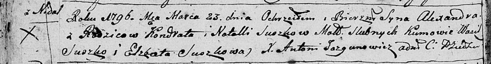
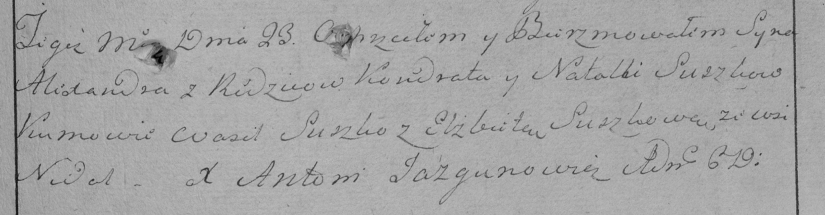

**Сушко Александр Кондратов (Suszko Alexander)**

23 марта 1796 г -- крещение (НИАБ 136-13-894, лист 28об, №34/1796-р
(ориг)), (РГИА 823-2-18, лист 255, №14/1796-р (коп)).

Лист 28-об. **Метрическая запись №34/1796-р (ориг).**

Дедиловичская Покровская церковь. 23 марта 1796 года. Метрическая запись
о крещении.

Suszko Alexander -- сын родителей с деревни Нeдаль.

Suszko Kondrat -- отец.

Suszkowa Natalla -- мать.

Suszko Wasil - кум.

Suszkowa Elżbieta - кума.

Jazgunowicz Antoni -- ксёндз.

**РГИА 823-2-18:** Лист 255. **Метрическая запись №14/1796-р (коп).**

Дедиловичская Покровская церковь. 23 марта 1796 года. Метрическая запись
о крещении.

Suszko Alexander -- сын родителей с деревни Недаль.

Suszko Kondrat -- отец.

Suszkowa Natalla -- мать.

Suszko Wasil -- кум.

Suszkowa Elżbieta -- кума.

Jazgunowicz Antoni -- ксёндз.
