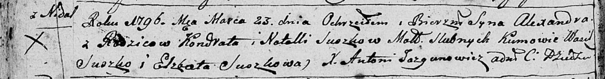

**Сушко Кондрат (Suszko Kondrat)**

26 сентября 1792 г -- крещение дочери Розалии (НИАБ 136-13-894, лист 17,
№58/1792-р (ориг)), (РГИА 823-2-18, лист 245, №27/1792-р (коп)).

23 марта 1796 г -- крещение сына Александра (НИАБ 136-13-894, лист 28об,
№34/1796-р (ориг)), (РГИА 823-2-18, лист 255, №14/1796-р (коп)).

1 апреля 1799 г -- крещение дочери Агаты Евы (НИАБ 136-13-894, лист
38об, №16/1799-р (ориг)), РГИА 823-2-18, лист 268об, №16/1799-р (коп),
НИАБ 136-13-938, лист 241об, №16/1799-р (коп)).

31 августа 1802 г -- крещение сына Яна Мацея (НИАБ 136-13-894, лист
47об, №31/1802-р (ориг)).

24 января 1805 г -- крещение сына Антона Онуфрыя (НИАБ 136-13-894, лист
56об, №12/1805-р (ориг)).

23 сентября 1806 г -- крещение дочери Анны (НИАБ 136-13-894, лист 61,
№42/1806-р (ориг)).

20 марта 1810 г -- крещение сына Якуба Антона (НИАБ 136-13-894, лист 77,
№12/1810-р (ориг)).

**НИАБ 136-13-894:** Лист 17. **Метрическая запись №58/1792-р (ориг).**

{width="6.496527777777778in"
height="0.7590124671916011in"}

Дедиловичская Покровская церковь. 26 сентября 1792 года. Метрическая
запись о крещении.

Suszkowna Rozalia -- дочь родителей с деревни Недаль.

Suszko Kondrat -- отец.

Suszkowa Natalla -- мать.

Suszko Wasil - кум.

Suszkowa Justyna - кума.

Jazgunowicz Antoni -- ксёндз.

**РГИА 823-2-18:** Лист 245. **Метрическая запись №27/1792-р (коп).**

{width="6.496527777777778in"
height="1.6631944444444444in"}

Дедиловичская Покровская церковь. 26 сентября 1792 года. Метрическая
запись о крещении.

Suszkowna Rozalia -- дочь родителей с деревни Недаль.

Suszko Kondrat -- отец.

Suszkowa Natalija -- мать.

Suszko Wasil -- кум.

Suszkowa Justyna -- кума.

Jazgunowicz Antoni -- ксёндз.

**НИАБ 136-13-894:** Лист 28-об. **Метрическая запись №34/1796-р
(ориг).**

{width="6.496527777777778in"
height="0.8575765529308836in"}

Дедиловичская Покровская церковь. 23 марта 1796 года. Метрическая запись
о крещении.

Suszko Alexander -- сын родителей с деревни Нeдаль.

Suszko Kondrat -- отец.

Suszkowa Natalla -- мать.

Suszko Wasil - кум.

Suszkowa Elżbieta - кума.

Jazgunowicz Antoni -- ксёндз.

**РГИА 823-2-18:** Лист 255. **Метрическая запись №14/1796-р (коп).**

{width="6.496527777777778in"
height="1.6930555555555555in"}

Дедиловичская Покровская церковь. 23 марта 1796 года. Метрическая запись
о крещении.

Suszko Alexander -- сын родителей с деревни Недаль.

Suszko Kondrat -- отец.

Suszkowa Natalla -- мать.

Suszko Wasil -- кум.

Suszkowa Elżbieta -- кума.

Jazgunowicz Antoni -- ксёндз.

**НИАБ 136-13-894:** Лист 38об. **Метрическая запись №16/1799-р
(ориг).**

{width="6.496527777777778in"
height="0.9661986001749782in"}

Дедиловичская Покровская церковь. 1 апреля 1799 года. Метрическая запись
о крещении.

Suszkowna Agata Ewa -- дочь родителей с деревни Недаль.

Suszko Kondrat -- отец.

Suszkowa Natalla -- мать.

Suszko Wasil-- кум.

Suszkowa Ahapa -- кума.

Jazgunowicz Antoni -- ксёндз.

**РГИА 823-2-18:** Лист 268об. **Метрическая запись №16/1799-р (коп).**

{width="6.496527777777778in"
height="1.8263888888888888in"}

Дедиловичская Покровская церковь. 1 апреля 1799 года. Метрическая запись
о крещении.

Suszkowna Agata -- дочь родителей с деревни Недаль.

Suszko Kondrat -- отец.

Suszkowa Natalla -- мать.

Suszko Wasil -- кум, с деревни Недаль.

Suszko Ahapa -- кума, с деревни Недаль.

Jazgunowicz Antoni -- ксёндз.

**НИАБ 136-13-938:** 241об. **Метрическая запись №16/1799-р (коп).**

(См. тж. НИАБ 136-13-894, лист 38об, №16/1799-р (ориг); РГИА 823-2-18,
лист 268об, №16/1799-р (коп))

{width="6.496527777777778in"
height="2.785416666666667in"}

Дедиловичская Покровская церковь. 1 апреля 1799 года. Метрическая запись
о крещении.

Suszkowna Agata Domicela -- дочь родителей с деревни Недаль.

Suszko Kondrat -- отец.

Suszkowa Natalla -- мать.

Suszko Wasil -- кум, с деревни Разлитье.

Suszkowa Ahapa - кума, с деревни Разлитье.

Jazgunowicz Antoni -- ксёндз.

**НИАБ 136-13-894:** Лист 47об. **Метрическая запись №31/1802-р
(ориг).**

{width="6.496527777777778in"
height="1.687661854768154in"}

Дедиловичская Покровская церковь. 31 августа 1802 года. Метрическая
запись о крещении.

Suszko Jan Maciey -- сын.

Suszko Kondrat -- отец.

Suszkowa Natalla -- мать.

Suszko Wasil -- кум.

Matryszyłowa Zynowija -- кума.

Jazgunowicz Antoni -- ксёндз.

**НИАБ 136-13-894:** Лист 56об. **Метрическая запись №12/1805-р
(ориг).**

{width="6.496527777777778in"
height="0.9990529308836396in"}

Дедиловичская Покровская церковь. 24 января 1805 года. Метрическая
запись о крещении.

Suszko Antoni Onufry -- сын родителей с деревни Недаль.

Suszko Kondrat -- отец.

Suszkowa Natalla -- мать.

Suszko Wasil -- кум, с деревни Нивки.

Matryszyłowa Zynowija -- кума, с деревни Нивки.

Jazgunowicz Antoni -- ксёндз.

**НИАБ 136-13-894:** Лист 61. **Метрическая запись №42/1806-р (ориг).**

{width="6.496527777777778in"
height="0.8716568241469816in"}

Дедиловичская Покровская церковь. 23 сентября 1806 года. Метрическая
запись о крещении.

Suszkowna Anna -- дочь родителей с деревни Недаль.

Suszko Kandrat -- отец.

Suszkowa Natalla -- мать.

Suszko Jan -- кум.

Marteszyłowa Zynowia -- кума.

Jazgunowicz Antoni -- ксёндз.

**НИАБ 136-13-894:** Лист 77. **Метрическая запись №12/1810-р (ориг).**

{width="6.496527777777778in"
height="1.4771237970253719in"}

Дедиловичская Покровская церковь. 20 марта 1810 года. Метрическая запись
о крещении.

Suszko Jakub Antoni -- сын родителей с деревни Нeдаль.

Suszko Kondrat -- отец.

Suszko Natalla -- мать.

Suszko Wasil -- кум.

Metraszyłowna Krystyna -- кума.

Jazgunowicz Antoni -- ксёндз.
