**Сушко Наталья (Suszkowa Natalla)**

26 сентября 1792 г -- крещение дочери Розалии (НИАБ 136-13-894, лист 17,
№58/1792-р (ориг)), (РГИА 823-2-18, лист 245, №27/1792-р (коп)).

23 марта 1796 г -- крещение сына Александра (НИАБ 136-13-894, лист 28об,
№34/1796-р (ориг)), (РГИА 823-2-18, лист 255, №14/1796-р (коп)).

1 апреля 1799 г -- крещение дочери Агаты Евы (НИАБ 136-13-894, лист
38об, №16/1799-р (ориг)), (РГИА 823-2-18, лист 268об, №16/1799-р (коп),
НИАБ 136-13-938, лист 241об, №16/1799-р (коп)).

31 августа 1802 г -- крещение сына Яна Мацея (НИАБ 136-13-894, лист
47об, №31/1802-р (ориг)).

3 мая 1803 г -- крестная мать у Палани Текли, дочери Кузуров Пархвена и
Елены с деревни Недаль (НИАБ 136-13-894, лист 50об, №19/1803-р (ориг)).

24 января 1805 г -- крещение сына Антона Онуфрыя (НИАБ 136-13-894, лист
56об, №12/1805-р (ориг)).

23 сентября 1806 г -- крещение дочери Анны (НИАБ 136-13-894, лист 61,
№42/1806-р (ориг)).

18 февраля 1806 г -- крестная мать Елены, дочери Пархвена и Елены Кузур
с деревни Недаль (НИАБ 136-13-894, лист 61об, №50/1806-р (ориг)).

2 мая 1807 г -- крестная мать Якуба Борыса, сына Сушков Степана и Маруты
с деревни Разлитье (НИАБ 136-13-894, лист 62об, №22/1807-р (ориг)).

Сентябрь 1807 г -- крестная мать Лаврентия, сына Иоанна и Анастасии
Семашков с деревни Недаль (НИАБ 937-4-32, лист 16, №16/1807-р).

20 марта 1810 г -- крещение сына Якуба Антона (НИАБ 136-13-894, лист 77,
№12/1810-р (ориг)).

**НИАБ 136-13-894:** Лист 17. **Метрическая запись №58/1792-р (ориг).**

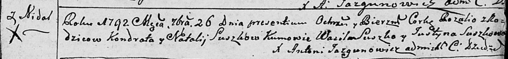

Дедиловичская Покровская церковь. 26 сентября 1792 года. Метрическая
запись о крещении.

Suszkowna Rozalia -- дочь родителей с деревни Недаль.

Suszko Kondrat -- отец.

Suszkowa Natalla -- мать.

Suszko Wasil - кум.

Suszkowa Justyna - кума.

Jazgunowicz Antoni -- ксёндз.

**РГИА 823-2-18:** Лист 245. **Метрическая запись №27/1792-р (коп).**

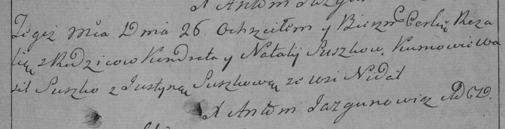

Дедиловичская Покровская церковь. 26 сентября 1792 года. Метрическая
запись о крещении.

Suszkowna Rozalia -- дочь родителей с деревни Недаль.

Suszko Kondrat -- отец.

Suszkowa Natalija -- мать.

Suszko Wasil -- кум.

Suszkowa Justyna -- кума.

Jazgunowicz Antoni -- ксёндз.

Лист 28-об. **Метрическая запись №34/1796-р (ориг).**

Дедиловичская Покровская церковь. 23 марта 1796 года. Метрическая запись
о крещении.

Suszko Alexander -- сын родителей с деревни Нeдаль.

Suszko Kondrat -- отец.

Suszkowa Natalla -- мать.

Suszko Wasil - кум.

Suszkowa Elżbieta - кума.

Jazgunowicz Antoni -- ксёндз.

**РГИА 823-2-18:** Лист 255. **Метрическая запись №14/1796-р (коп).**

Дедиловичская Покровская церковь. 23 марта 1796 года. Метрическая запись
о крещении.

Suszko Alexander -- сын родителей с деревни Недаль.

Suszko Kondrat -- отец.

Suszkowa Natalla -- мать.

Suszko Wasil -- кум.

Suszkowa Elżbieta -- кума.

Jazgunowicz Antoni -- ксёндз.

**НИАБ 136-13-894:** Лист 38об. **Метрическая запись №16/1799-р
(ориг).**

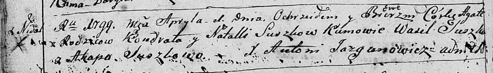

Дедиловичская Покровская церковь. 1 апреля 1799 года. Метрическая запись
о крещении.

Suszkowna Agata Ewa -- дочь родителей с деревни Недаль.

Suszko Kondrat -- отец.

Suszkowa Natalla -- мать.

Suszko Wasil-- кум.

Suszkowa Ahapa -- кума.

Jazgunowicz Antoni -- ксёндз.

**РГИА 823-2-18:** Лист 268об. **Метрическая запись №16/1799-р (коп).**

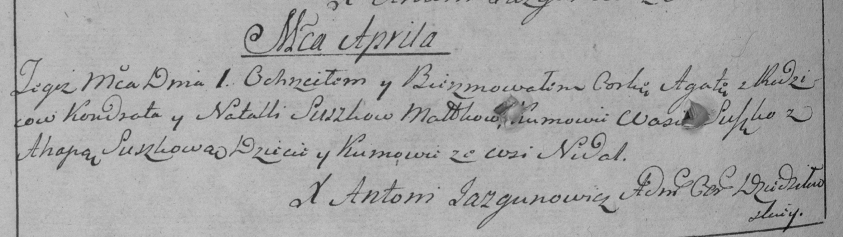

Дедиловичская Покровская церковь. 1 апреля 1799 года. Метрическая запись
о крещении.

Suszkowna Agata -- дочь родителей с деревни Недаль.

Suszko Kondrat -- отец.

Suszkowa Natalla -- мать.

Suszko Wasil -- кум, с деревни Недаль.

Suszko Ahapa -- кума, с деревни Недаль.

Jazgunowicz Antoni -- ксёндз.

**НИАБ 136-13-938:** 241об. **Метрическая запись №16/1799-р (коп).**

(См. тж. НИАБ 136-13-894, лист 38об, №16/1799-р (ориг); РГИА 823-2-18,
лист 268об, №16/1799-р (коп))

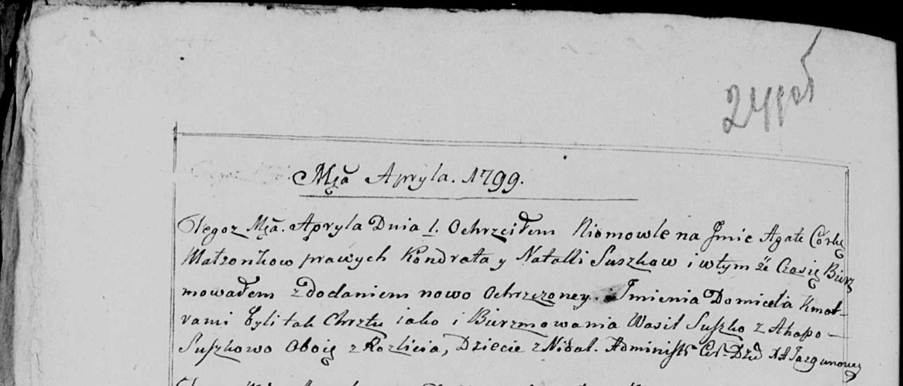

Дедиловичская Покровская церковь. 1 апреля 1799 года. Метрическая запись
о крещении.

Suszkowna Agata Domicela -- дочь родителей с деревни Недаль.

Suszko Kondrat -- отец.

Suszkowa Natalla -- мать.

Suszko Wasil -- кум, с деревни Разлитье.

Suszkowa Ahapa - кума, с деревни Разлитье.

Jazgunowicz Antoni -- ксёндз.

**НИАБ 136-13-894:** Лист 47об. **Метрическая запись №31/1802-р
(ориг).**

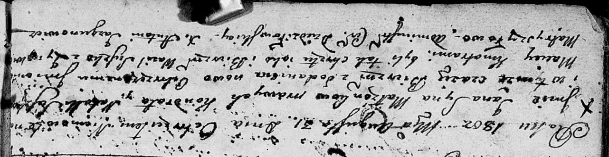

Дедиловичская Покровская церковь. 31 августа 1802 года. Метрическая
запись о крещении.

Suszko Jan Maciey -- сын.

Suszko Kondrat -- отец.

Suszkowa Natalla -- мать.

Suszko Wasil -- кум.

Matryszyłowa Zynowija -- кума.

Jazgunowicz Antoni -- ксёндз.

**НИАБ 136-13-894:** Лист 50об. **Метрическая запись №19/1803-р
(ориг).**

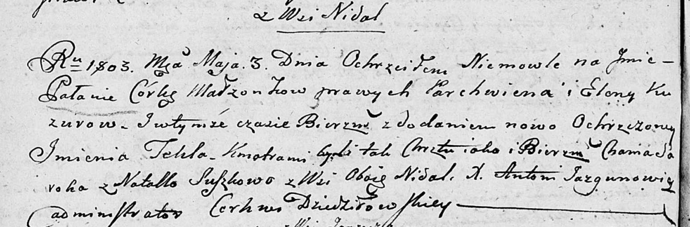

Дедиловичская Покровская церковь. 3 мая 1803 года. Метрическая запись о
крещении.

Kuzurowna Pałania Tekla -- дочь родителей с деревни Недаль.

Kuzura Parchwien -- отец.

Kuzurowa Elena -- мать.

Saroka Chama -- кум.

Suszkowa Natalla -- кума, с деревни Недаль.

Jazgunowicz Antoni -- ксёндз.

**НИАБ 136-13-894:** Лист 56об. **Метрическая запись №12/1805-р
(ориг).**

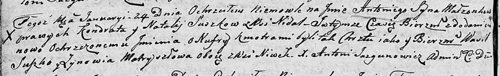

Дедиловичская Покровская церковь. 24 января 1805 года. Метрическая
запись о крещении.

Suszko Antoni Onufry -- сын родителей с деревни Недаль.

Suszko Kondrat -- отец.

Suszkowa Natalla -- мать.

Suszko Wasil -- кум, с деревни Нивки.

Matryszyłowa Zynowija -- кума, с деревни Нивки.

Jazgunowicz Antoni -- ксёндз.

**НИАБ 136-13-894:** Лист 61. **Метрическая запись №42/1806-р (ориг).**

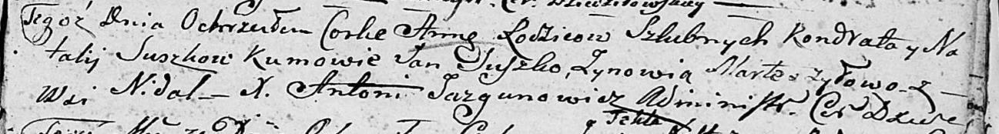

Дедиловичская Покровская церковь. 23 сентября 1806 года. Метрическая
запись о крещении.

Suszkowna Anna -- дочь родителей с деревни Недаль.

Suszko Kandrat -- отец.

Suszkowa Natalla -- мать.

Suszko Jan -- кум.

Marteszyłowa Zynowia -- кума.

Jazgunowicz Antoni -- ксёндз.

**НИАБ 136-13-894:** Лист 61об. **Метрическая запись №50/1806-р
(ориг).**

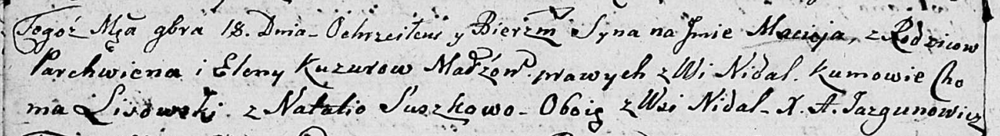

Дедиловичская Покровская церковь. 18 ноября 1806 года. Метрическая
запись о крещении.

Kuzura Maciey -- сын родителей с деревни Недаль.

Kuzura Parchwien -- отец.

Kuzurowa Elena -- мать.

Lisowski Choma -- кум, с деревни Недаль.

Suszkowa Natalia -- кума, с деревни Недаль.

Jazgunowicz Antoni -- ксёндз.

**НИАБ 136-13-894:** Лист 61об. **Метрическая запись №50/1806-р
(ориг).**

Дедиловичская Покровская церковь. 18 ноября 1806 года. Метрическая
запись о крещении.

Kuzura Maciey -- сын родителей с деревни Недаль.

Kuzura Parchwien -- отец.

Kuzurowa Elena -- мать.

Lisowski Choma -- кум, с деревни Недаль.

Suszkowa Natalia -- кума, с деревни Недаль.

Jazgunowicz Antoni -- ксёндз.

**НИАБ 136-13-894:** Лист 62об. **Метрическая запись №22/1807-р
(ориг).**

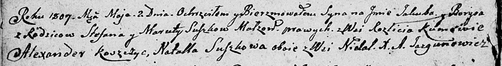

Дедиловичская Покровская церковь. 2 мая 1807 года. Метрическая запись о
крещении.

Suszko Jakub Barys -- сын родителей с деревни Разлитье.

Suszko Stefan -- отец.

Suszkowa Maruta -- мать.

Koszczyc Alexander -- кум, с деревни Недаль.

Suszkowa Natalla -- кума, с деревни Недаль.

Jazgunowicz Antoni -- ксёндз.

**НИАБ 937-4-32:** Лист 16. **Метрическая запись №16/1807-р.**

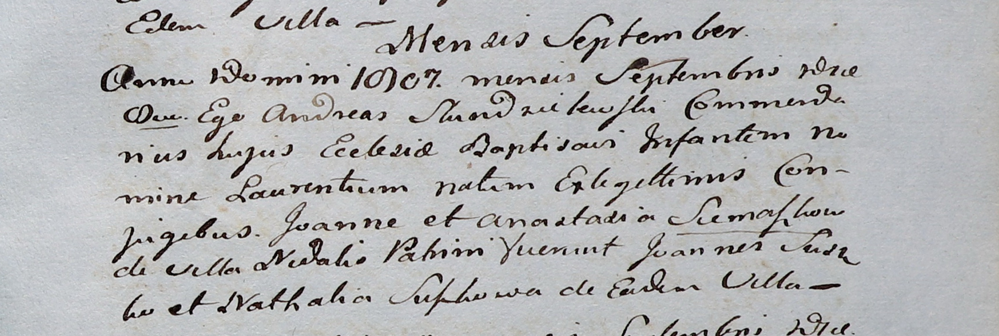

Дедиловичский костел Наисвятейшего Сердца Иисуса. сентября 1807 года.
Метрическая запись о крещении.

Siemaszko Łaurenti -- сын родителей с деревни Недаль.

Siemaszko Joann -- отец.

Siemaszkowa Anastazia -- мать.

Suszko Joann -- крестный отец.

Suszkowa Nathalia -- крестная мать, с деревни Недаль.

Scindzelewski Andreas -- ксёндз, викарий Дедиловичский.

**НИАБ 136-13-894:** Лист 77. **Метрическая запись №12/1810-р (ориг).**

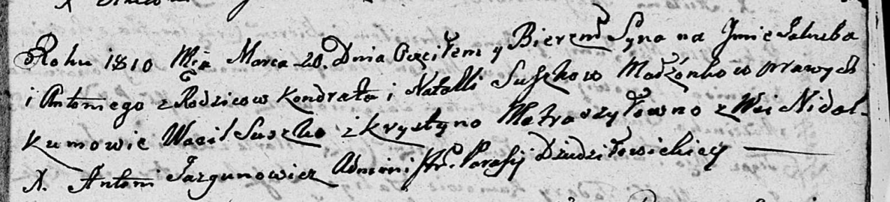

Дедиловичская Покровская церковь. 20 марта 1810 года. Метрическая запись
о крещении.

Suszko Jakub Antoni -- сын родителей с деревни Нeдаль.

Suszko Kondrat -- отец.

Suszko Natalla -- мать.

Suszko Wasil -- кум.

Metraszyłowna Krystyna -- кума.

Jazgunowicz Antoni -- ксёндз.
