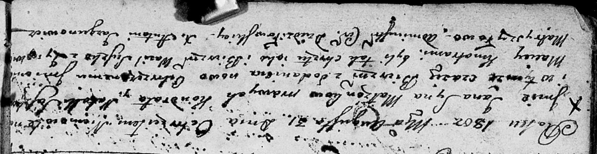

**Сушко Яна Кондратов (Suszko Jan Maciey)**

31 августа 1802 г -- крещение (НИАБ 136-13-894, лист 47об, №31/1802-р
(ориг)).

**НИАБ 136-13-894:** Лист 47об. **Метрическая запись №31/1802-р
(ориг).**

Дедиловичская Покровская церковь. 31 августа 1802 года. Метрическая
запись о крещении.

Suszko Jan Maciey -- сын.

Suszko Kondrat -- отец.

Suszkowa Natalla -- мать.

Suszko Wasil -- кум.

Matryszyłowa Zynowija -- кума.

Jazgunowicz Antoni -- ксёндз.
