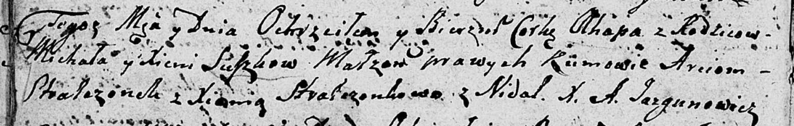

**Сушко Агапа Михалова (Suszkowna Ahapa)**

20 сентября 1808 г -- крещение (НИАБ 136-13-894, лист 65об, №29/1808-р
(ориг)).

**НИАБ 136-13-894:** Лист 65об. **Метрическая запись №29/1808-р
(ориг).**

{width="6.496527777777778in"
height="1.0332491251093614in"}

Дедиловичская Покровская церковь. 20 сентября 1808 года. Метрическая
запись о крещении.

Suszkowa Ahapa -- дочь родителей с деревни Недаль.

Suszko Michał -- отец.

Suszkowa Xienia -- мать.

Stralczoneck Arciom -- кум.

Stralczonkowa Xienia -- кума.

Jazgunowicz Antoni -- ксёндз.
