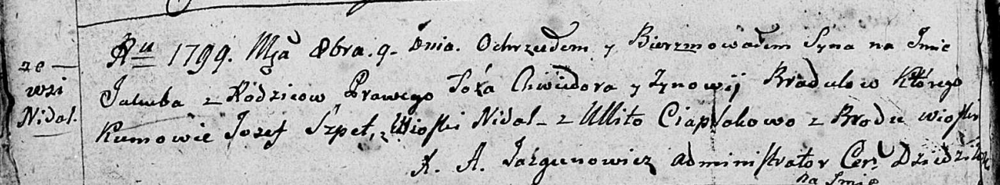

**Брадульская (Сушко) Зыновия (Bradulska Zynowija z Suszkow)**

5 ноября 1794 г -- венчание с Хведором Барадульским с деревни Иканы
Кимейской парафии (НИАБ 136-13-920, лист 1об, №10/1794-б (ориг)).

**НИАБ 136-13-894:** Лист 39об. **Метрическая запись №40/1799-р
(ориг).**

Дедиловичская Покровская церковь. 9 октября 1799 года. Метрическая
запись о крещении.

Bradul Jakub -- сын родителей с деревни Недаль.

Bradul Chwiedor -- отец.

Bradulowa Zynowija -- мать.

Szpet Jozef -- кум, с деревни Недаль.

Ciaplakowa Ullita -- кума, с деревни Броды.

Jazgunowicz Antoni -- ксёндз.
