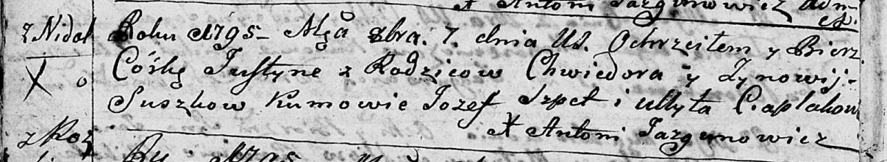

**Сушко Хведор (Suszko Chwiedor)**

7 октября 1795 г -- крещение дочери Юстыны (НИАБ 136-13-894, лист 25об,
№42/1795-р (ориг)).

**НИАБ 136-13-894:** Лист 25об. **Метрическая запись №42/1795-р
(ориг).**

{width="6.496527777777778in"
height="1.1908180227471565in"}

Дедиловичская Покровская церковь. 7 октября 1795 года. Метрическая
запись о крещении.

Suszkowna Justyna -- дочь родителей с деревни Нeдаль.

Suszko Chwiedor -- отец.

Suszkowa Zynowija -- мать.

Szpet Jozef - кум.

Ciaplakowa Ullyta - кума.

Jazgunowicz Antoni -- ксёндз.
