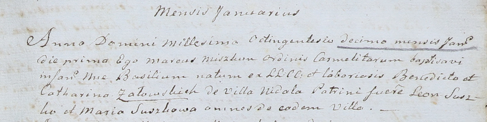

**Сушко Марьяна, Мария (Suszkowa Marjana, Maria)**

4 сентября 1804 г -- крещение сына Яна Балтромея (НИАБ 136-13-894, лист
54об, №35/1804-р (ориг)).

1 января 1810 г -- крестная мать Базыля, сына Бенедикта и Катерины
Семашков с деревни Недаль (НИАБ 937-4-32, лист 21, №1/1810-р).

**НИАБ 136-13-894:** Лист 54об. **Метрическая запись №35/1804-р
(ориг).**

Дедиловичская Покровская церковь. 4 сентября 1804 года. Метрическая
запись о крещении.

Suszko Jan Bałtromey -- дочь родителей с деревни Недаль.

Suszko Chama -- отец.

Suszkowa Marjana -- мать.

Suszko Gabriel -- кум.

Suszkowa Ahafija -- кума.

Jazgunowicz Antoni -- ксёндз.

**НИАБ 937-4-32:** Лист 21. **Метрическая запись №1/1810-р.**

Дедиловичский костел Наисвятейшего Сердца Иисуса. 1 января 1810 года.
Метрическая запись о крещении.

Załowski \[Siemaszko\] Basili -- сын крестьян с деревни Недаль.

Załowski \[Siemaszko\] Benedict -- отец.

Załowska \[Siemaszkowa\] Catharina -- мать.

Suszko Leon -- крестный отец, с деревни Недаль.

Suszkowa Maria -- крестная мать, с деревни Недаль.

Miszkun Marcus -- ксёндз, комендант Дедиловичский.
