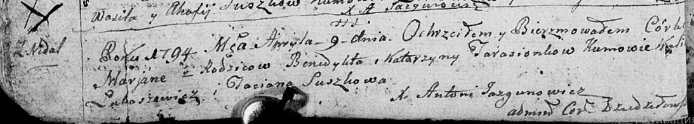
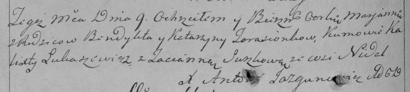

**Тарасёнок Катерина (Tarasionkowa Katerzyna)**

9 апреля 1794 г -- крещение дочери Марьяны (НИАБ 136-13-894, лист 21об,
№19/1794-р (ориг)), (РГИА 823-2-18, лист 249об, №12/1794-р (коп)).

**НИАБ 136-13-894:** Лист 21-об. **Метрическая запись №19/1794-р
(ориг).**

Дедиловичская Покровская церковь. 9 апреля 1794 года. Метрическая запись
о крещении.

Tarasionkowna Marjana -- дочь родителей с деревни Недаль.

Tarasionak Benedykt -- отец.

Tarasionkowa Katerzyna -- мать.

Łukaszewicz Kalist - кум.

Suszkowa Taciana - кума.

Jazgunowicz Antoni -- ксёндз.

**РГИА 823-2-18:** Лист 249об. **Метрическая запись №12/1794-р (коп).**

Дедиловичская Покровская церковь. 9 апреля 1794 года. Метрическая запись
о крещении.

Tarasionkowna Marjanna -- дочь родителей с деревни Недаль.

Tarasionek Benedykt -- отец.

Tarasionkowa Katarzyna -- мать.

Łukaszewicz Kalixt -- кум.

Suszkowa Tacianna -- кума.

Jazgunowicz Antoni -- ксёндз.
