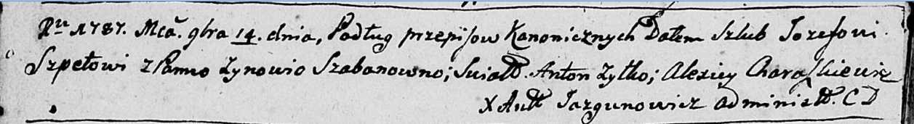

**Шпет Иосиф (Szpet Jozef)**

14 ноября 1787 г -- венчание с Зыновией Шабан (НИАБ 136-13-894, лист
66об, №15/1787-б (ориг)).

22 июля 1789 г -- крещение дочери Магдалены (НИАБ 136-13-894, лист 7об,
№37/1789-р (ориг)).

**НИАБ 136-13-894:** Лист 66об. **Метрическая запись №15/1787-б
(ориг).**

Дедиловичская Покровская церковь. 14 ноября 1787 года. Метрическая
запись о венчании.

Szpet Jozef -- жених с деревни \[Недаль\].

Szabanowna Zynowia -- невеста.

Żyłko Anton -- свидетель.

Charaskiewicz Alexiey -- свидетель.

Jazgunowicz Antoni -- ксёндз.

**НИАБ 136-13-894:** Лист 7об. **Метрическая запись №37/1789-р (ориг).**

Дедиловичская Покровская церковь. 22 июля 1789 года. Метрическая запись
о крещении.

Szpetowna Magdalena -- дочь родителей с деревни Недаль.

Szpet Jozef -- отец.

Szpetowa Zynowija -- мать.

Suszko Piatruś - кум.

Ciaplakowa Parasia - кума.

Jazgunowicz Antoni -- ксёндз.
