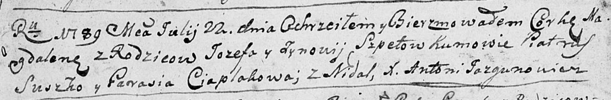

**Шпет Магдалена Иосифова (Szpetowna Magdalena)**

22 июля 1789 г -- крещение (НИАБ 136-13-894, лист 7об, №37/1789-р
(ориг)).

**НИАБ 136-13-894:** Лист 7об. **Метрическая запись №37/1789-р (ориг).**

Дедиловичская Покровская церковь. 22 июля 1789 года. Метрическая запись
о крещении.

Szpetowna Magdalena -- дочь родителей с деревни Недаль.

Szpet Jozef -- отец.

Szpetowa Zynowija -- мать.

Suszko Piatruś - кум.

Ciaplakowa Parasia - кума.

Jazgunowicz Antoni -- ксёндз.
