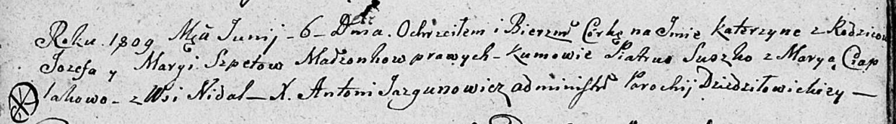

**Шпет Марыя (Szpetowa Marya)**

27 июля 1802 г -- крещение дочери Анны Крыстыны (НИАБ 136-13-894, лист
47об, №29/1802-р (ориг)).

7 июля 1805 г -- крещение сына Сымона Прокопа (НИАБ 136-13-894, лист
57об, №31/1805-р (ориг)).

6 июля 1809 г -- крещение дочери Катерыны (НИАБ 136-13-894, лист 74об,
№26/1809-р (ориг)).

**НИАБ 136-13-894:** Лист 47об. **Метрическая запись №29/1802-р
(ориг).**

{width="6.496527777777778in"
height="1.7560542432195976in"}

Дедиловичская Покровская церковь. 27 июля 1802 года. Метрическая запись
о крещении.

Szpetowna Anna Krystyna -- дочь родителей с деревни Недаль.

Szpet Jozef -- отец.

Szpetowa Maryia -- мать.

Suszko Piotr -- кум.

Czaplaiowa Maryna -- кума.

Jazgunowicz Antoni -- ксёндз.

**НИАБ 136-13-894:** Лист 57об. **Метрическая запись №31/1805-р
(ориг).**

{width="6.496527777777778in"
height="1.3229068241469817in"}

Дедиловичская Покровская церковь. 7 июля 1805 года. Метрическая запись о
крещении.

Szpet Symon Prokop -- сын родителей с деревни Недаль.

Szpet Jozef -- отец.

Szpetowa Maryia -- мать.

Suszko Sauka -- кум.

Czaplaiowa Maryia -- кума.

Jazgunowicz Antoni -- ксёндз.

**НИАБ 136-13-894:** Лист 74об. **Метрическая запись №26/1809-р
(ориг).**

{width="6.496527777777778in"
height="0.9058530183727034in"}

Дедиловичская Покровская церковь. 6 июня 1809 года. Метрическая запись о
крещении.

Szpetowna Katerzyna -- дочь родителей с деревни Недаль.

Szpet Jozef -- отец.

Szpetowa Marya -- мать.

Suszko Piatruś -- кум.

Ciaplakowa Marya -- кума.

Jazgunowicz Antoni -- ксёндз.
