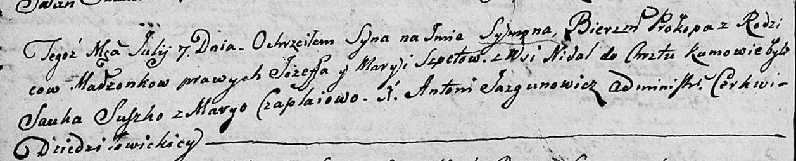

**Шпет Сымон Иосифов (Szpet Symon Prokop)**

7 июля 1805 г -- крещение (НИАБ 136-13-894, лист 57об, №31/1805-р
(ориг)).

**НИАБ 136-13-894:** Лист 57об. **Метрическая запись №31/1805-р
(ориг).**

{width="6.496527777777778in"
height="1.3229068241469817in"}

Дедиловичская Покровская церковь. 7 июля 1805 года. Метрическая запись о
крещении.

Szpet Symon Prokop -- сын родителей с деревни Недаль.

Szpet Jozef -- отец.

Szpetowa Maryia -- мать.

Suszko Sauka -- кум.

Czaplaiowa Maryia -- кума.

Jazgunowicz Antoni -- ксёндз.
